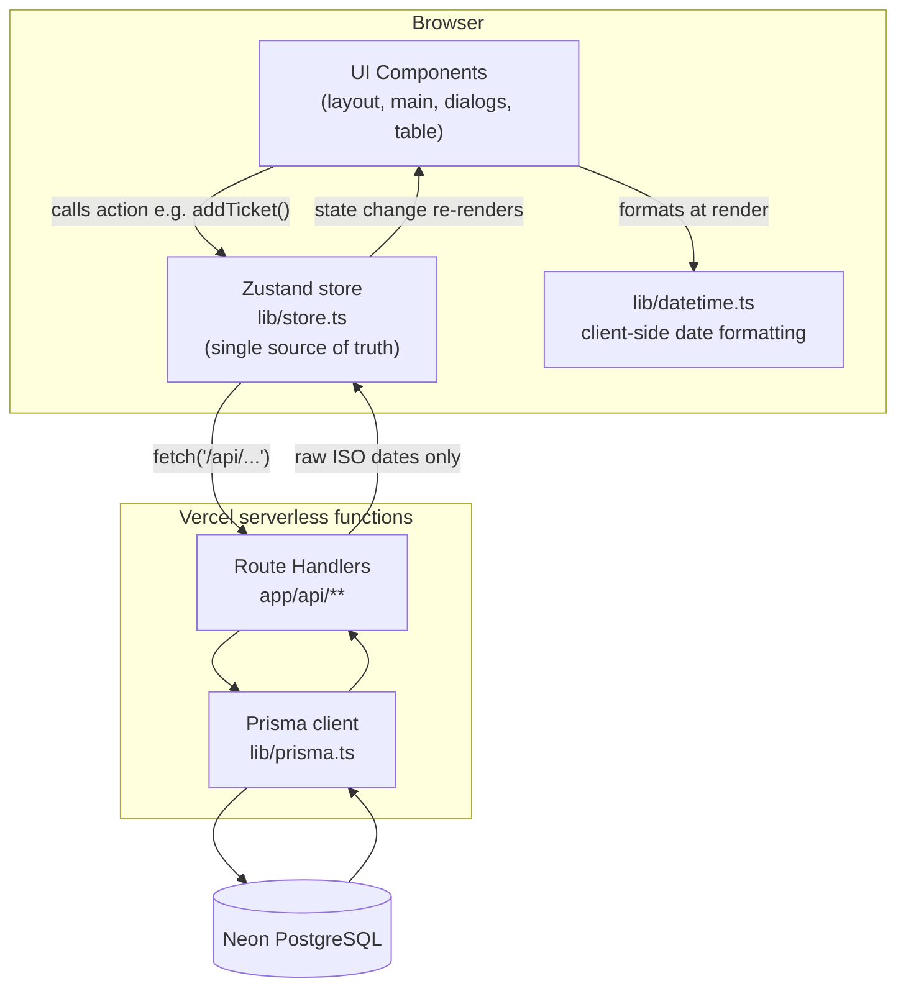
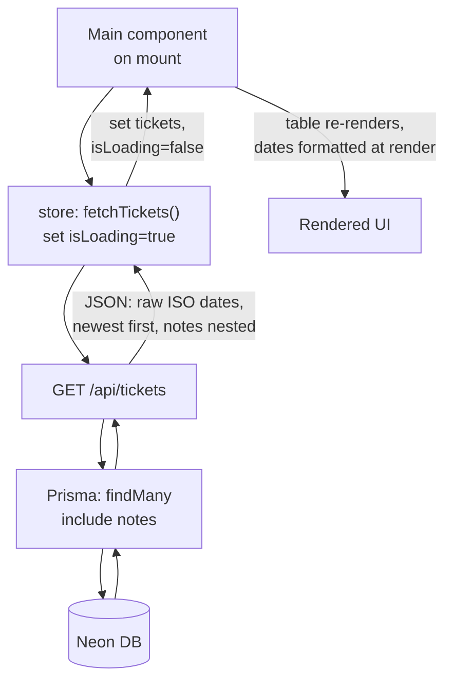
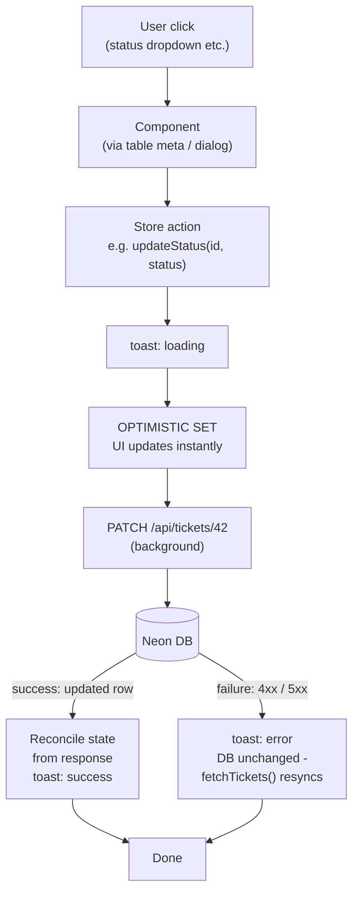
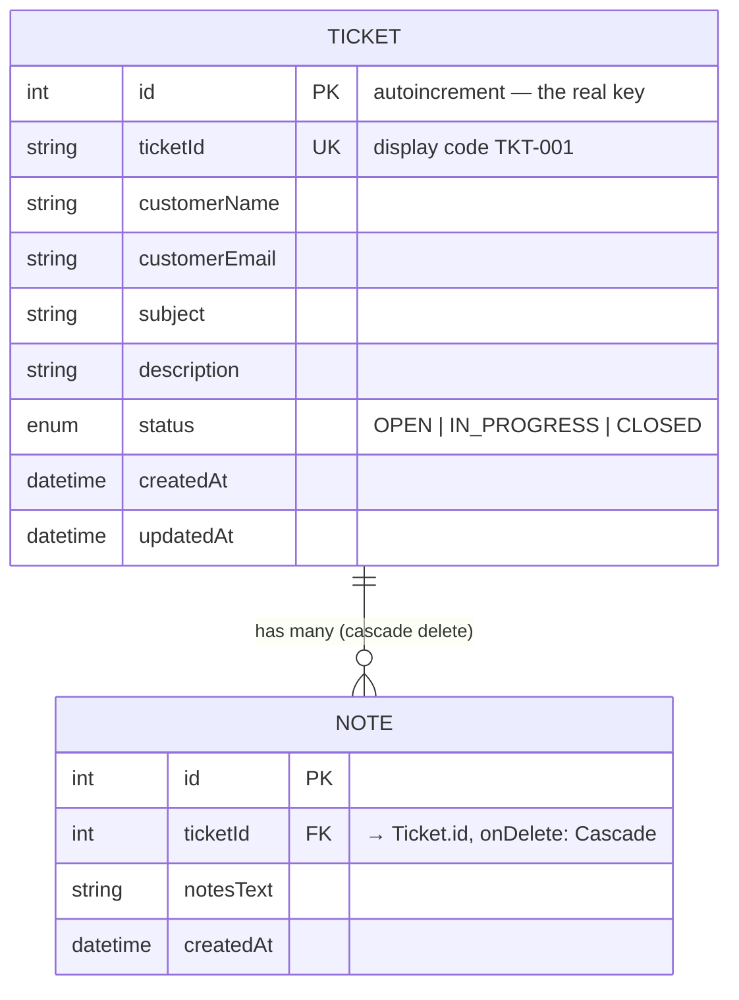
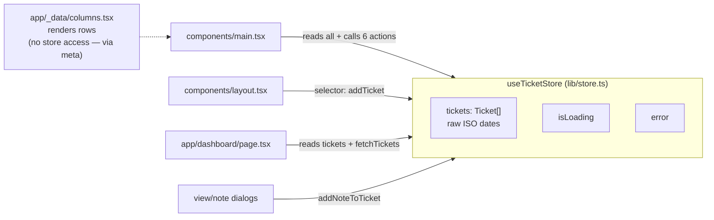
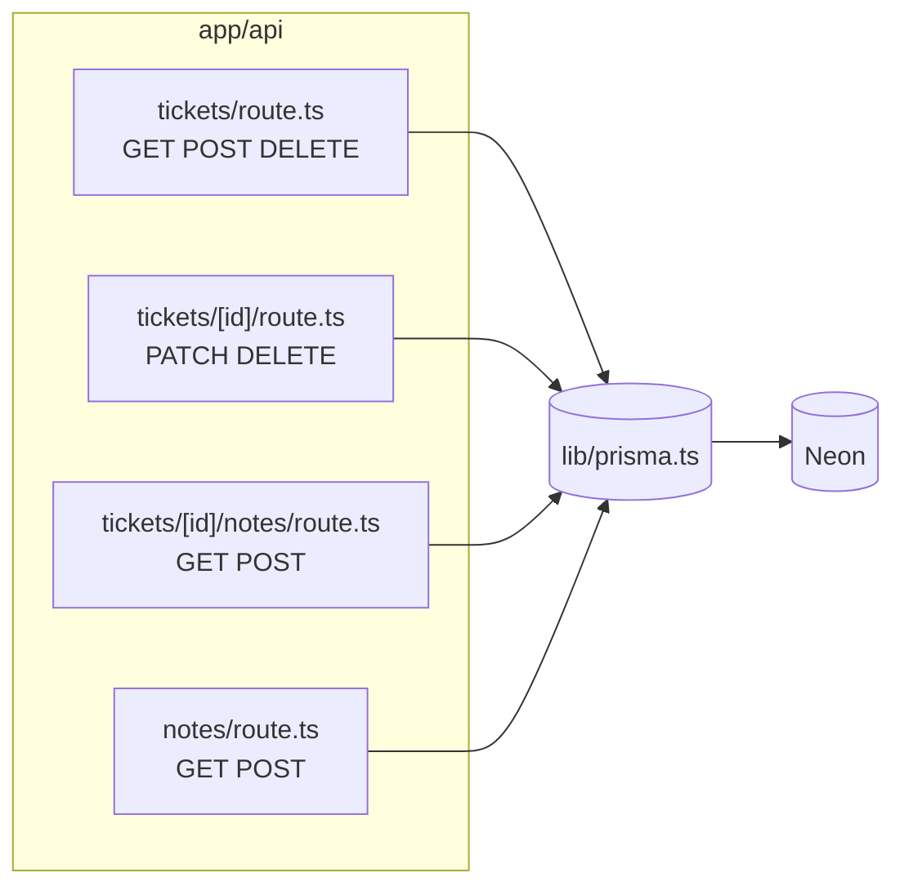
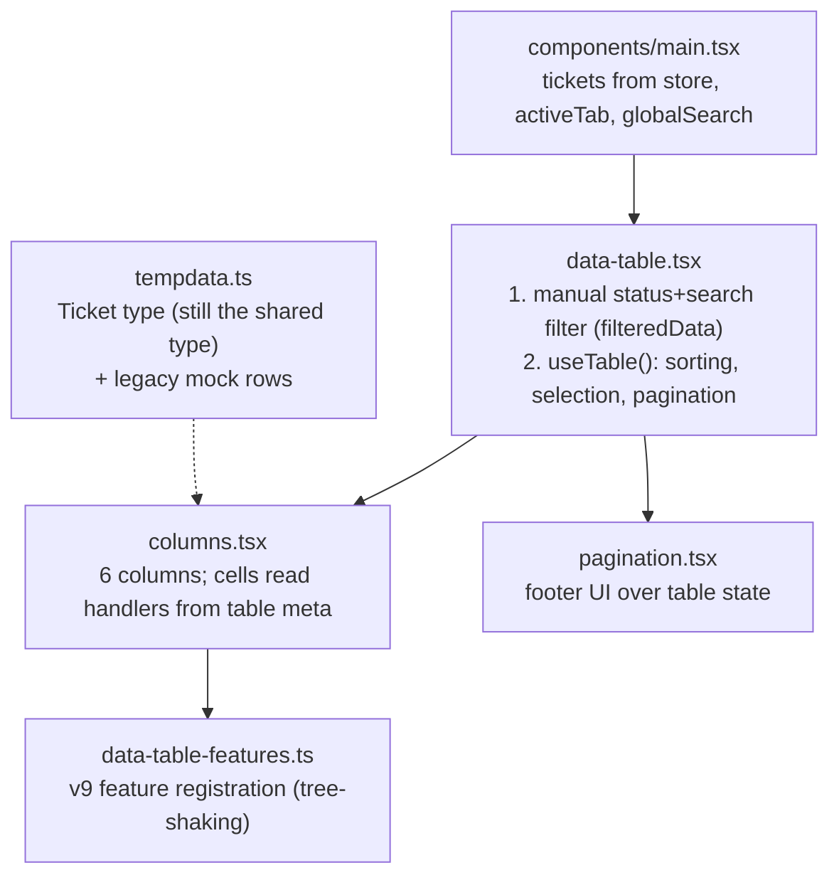
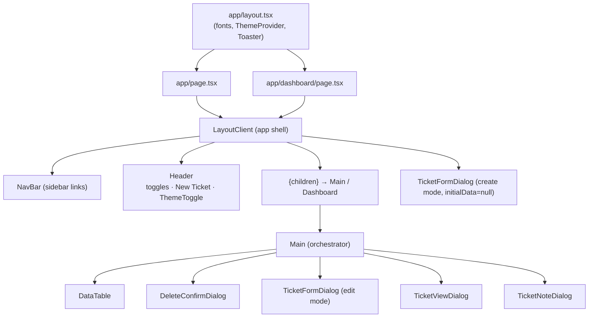

# GeTiC — Architecture Guide

> Companion to the in-code comments. Every folder and file explained: what it is,
> why it exists, and how it connects to the rest. Diagrams first, details after.
>
> **How to use this doc**: read ✦1 & ✦2 once to get the mental model, then use ✦3
> as a map whenever you open a file. ✦4 collects the patterns worth naming out
> loud in an interview. ✦5 lists known debts (so nothing surprises you), and ✦6
> gives a reading order for re-learning the codebase.

---

## 1. Bird's-eye view

### The stack, and why each piece is there

| Layer | Tech | Why this choice |
|---|---|---|
| Framework | **Next.js 16** (App Router) | React 19 + serverless API routes in one deploy; static shell + client interactivity |
| Language | **TypeScript 5** | types across UI, store, API, DB |
| State | **Zustand 5** | one `create()` call; no providers/reducers; selectors limit re-renders; powers optimistic updates |
| Table | **TanStack Table v9** | headless sorting/filter/pagination/selection; v9's opt-in feature registration |
| Styling | **Tailwind v4** | utility CSS, dark mode via class strategy |
| UI kit | **shadcn-style components on Base UI** | copy-owned primitives (not a black-box npm package) |
| Charts | **Recharts 3** | declarative SVG charts, client-only |
| DB | **PostgreSQL (Neon)** | managed, serverless-friendly |
| ORM | **Prisma 7 + `@prisma/adapter-pg`** | typed queries; driver adapter instead of the Rust engine |
| Validation | **Zod 4** | form validation in the create/edit dialog (API-side validation is manual — see ✦5) |
| Deploy | **Vercel** + Neon | route handlers become serverless functions |

### The one diagram to memorize

Everything flows through the Zustand store. Components never call the API
directly, and the API never formats data for display.



**The rule that keeps this clean:** the server stores and returns *absolute
instants* (ISO 8601 UTC); the client renders them in the *viewer's timezone*.
This was a real production bug (Vercel runs in UTC → users saw wrong times) —
fixed by removing all server-side `toLocaleString` and formatting only in
`lib/datetime.ts`.

---

## 2. Request lifecycle (the two paths)

### Read path — what happens on page load



### Write path — the optimistic update pattern (every mutation)



Trade-off to articulate: **instant perceived speed** in exchange for a small
window where local state can differ from the database. Rollback here is
implicit (DB never changed); a `fetchTickets()` resync is the escape hatch.

---

## 3. Folder-by-folder

```
getic/
├── prisma/            DB schema + seed data          → ✦3.1
├── lib/               store, prisma, datetime, utils → ✦3.2
├── app/               routes, API, generated client  → ✦3.3
│   └── _data/         the TanStack table engine      → ✦3.4
├── components/        app shell, orchestrator, dialogs, theme → ✦3.5
│   └── ui/            shadcn-style primitives        → ✦3.6
├── hooks/             one custom hook                → ✦3.7
├── public/            static assets (logo, favicons) → ✦3.8
├── README.assets/     images used by README.md       → ✦3.8
└── (root)             config files                   → ✦3.9
```

---

### 3.1 `prisma/` — the database layer



| File | Role |
|---|---|
| **`schema.prisma`** | Two models + one native Postgres enum. Key decisions: (1) `ticketId` is a *display* code kept separate from the numeric PK — POST creates the row, reads the generated id, then updates with `TKT-${String(id).padStart(3,'0')}`. (2) `onDelete: Cascade` means the API's DELETE routes never manually clean notes. (3) `Status` is a DB-level enum, so invalid values are rejected by Postgres itself. (4) The custom `generator` output points at `../app/generated/prisma`. |
| **`seed.ts`** | Dev utility: reads `ticketData` from `tickets.ts`, maps the UI spelling `"IN PROGRESS"` → enum `"IN_PROGRESS"`, and bulk-inserts. Run via `pnpm prisma:seed` (script: `tsx prisma/seed.ts`). Note the clearing block is commented out — re-running without clearing duplicates rows. |
| **`tickets.ts`** | 109 realistic mock tickets (TS array, typed). Source data for the seeder. Dates are raw-ish timestamp strings — consistent with "raw dates everywhere" contract. |

---

### 3.2 `lib/` — the brain

| File | Role |
|---|---|
| **`store.ts`** | **The single source of truth.** One zustand store: `tickets`, `isLoading`, `error` + 7 actions (`fetchTickets`, `addTicket`, `updateStatus`, `updateTicket`, `deleteTicket`, `deleteBulkTickets`, `addNoteToTicket`). Every action follows the same choreography: loading toast → (mutations: optimistic `set()` first) → `fetch` → reconcile state from the response → morph toast to success/error. State always holds **raw ISO UTC strings**; it never stores formatted display strings. |
| **`prisma.ts`** | The **Prisma singleton**. In dev, Next hot-reloads modules; without stashing the client on `globalThis`, each reload spawns a new connection pool and eventually exhausts Postgres. In production each serverless instance is a single cold process, so one client per instance is correct. Uses the Prisma 7 **driver adapter** (`PrismaPg` over node-postgres) instead of the built-in engine. `dotenv/config` import loads `.env` locally. |
| **`datetime.ts`** | **Client-only** formatters (`formatDate`, `formatDateTime`). The whole timezone bug lives and dies here: `new Date(iso)` parses an absolute instant, and `toLocale*` renders it in the *runtime's* timezone — which in the browser is the viewer's, but on Vercel is UTC. Hence the file-header rule: never run server-side. |
| **`utils.ts`** | The shadcn-standard `cn()` helper: `clsx` (conditional classes) + `tailwind-merge` (later Tailwind classes win conflicts). Used by every UI primitive. |

Store topology — who reads and writes what:



---

### 3.3 `app/` — routes and API (Next.js App Router)

| Path | Kind | Role |
|---|---|---|
| `layout.tsx` | Server component | Root layout: Google fonts as CSS variables, `ThemeProvider`, and the single `<Toaster />` every `toast.add()` renders into. `suppressHydrationWarning` is required by next-themes. |
| `page.tsx` | Server component | Route `/` — a thin composition: `<LayoutClient><Main /></LayoutClient>`. Stays a server component so the shell can be statically rendered. |
| `dashboard/page.tsx` | Client component | Route `/dashboard` — analytics. Four summary cards + three Recharts charts, **all computed client-side** from the same store (no analytics API). Gated on an `isClient` flag because Recharts measures the DOM (SSR would cause hydration mismatches). Timeline chart groups tickets by *local calendar day* and sorts chronologically (was previously alphabetical-by-string). |
| `globals.css` | CSS | Tailwind v4 entry + design tokens (CSS variables for both themes). |
| `generated/prisma/` | Generated | **Do not edit.** Output of `npx prisma generate`. `client.ts` is what `lib/prisma.ts` imports; `models/*.ts` hold the row types. Checked in so builds don't need a generate step. |
| `_data/` | Mixed | The table engine — see ✦3.4. |

#### The API — five endpoints, four files

| Endpoint | Methods | Behavior |
|---|---|---|
| `/api/tickets` | GET | All tickets, newest first, **notes nested** via `include` — the view dialog never needs a second fetch |
| | POST | Two-step create: insert → read `id` → update `ticketId = TKT-XXX` |
| | DELETE | Bulk delete by `{ ids: [...] }` (`deleteMany`) |
| `/api/tickets/[id]` | PATCH | Partial update via spread-conditional `data` (only sent fields are touched); normalizes `"IN PROGRESS"` → `"IN_PROGRESS"` |
| | DELETE | Single delete (notes cascade in the DB) |
| `/api/tickets/[id]/notes` | GET, POST | Notes scoped by URL; POST also bumps the ticket's `updatedAt` |
| `/api/notes` | GET, POST | Same job as above, scoped by query param instead — two doors into one table (see ✦5) |

Every route: raw ISO dates out, no display formatting, try/catch → JSON error
with proper status codes. Params are awaited because Next 15+ makes dynamic
route `params` a Promise.



---

### 3.4 `app/_data/` — the TanStack Table engine

The name `_data` is historical (it started as table mock data); today it's the
entire reusable table. The underscore prefix is a Next.js convention signal for
"not a route".



| File | Details worth knowing |
|---|---|
| **`data-table.tsx`** | The headless table + shadcn `<Table>` rendering. Prepends a **checkbox column** (selection), translates tab clicks into a `status` column filter, and applies global search **manually before** `useTable` (matches ticketId/subject/customerName). Critical line: `getRowId: row => String(row.id)` — without stable row ids, selection breaks across sort/page. Bulk-delete button intentionally avoids `window.confirm` (blocked in some iframes) and calls `onBulkDelete` → styled dialog in main.tsx. |
| **`columns.tsx`** | 6 columns: ID, Subject, Customer (avatar), Status (dropdown → meta callback), Date, Actions ("…" menu). The **`meta` indirection** is the key pattern: cells can't use hooks/store, so `data-table.tsx` passes callbacks through `table.options.meta` and cells pull them out. Date column sorts on the raw value (ISO strings sort chronologically) but *displays* `formatDate(...)` client-side. |
| **`data-table-features.ts`** | TanStack v9's headline change: **no built-in features**. Sorting, pagination, selection etc. are registered here; anything unregistered is tree-shaken out. The exported `features` object is also the generic parameter (`DataTableFeatures`) used across all table files. |
| **`pagination.tsx`** | Pure UI footer: page size select, page x of y, first/prev/next/last. All state lives in the table instance (`initialState.pagination`); client-side only (the API returns every row). |
| **`tempdata.ts`** | Defines the shared `Ticket`/`Note` types (mirrors the Prisma model; unifying them is a TODO) + the original 8 mock tickets. **Legacy**: real data comes from the API, but the type is still the app's contract. |
| **`page.tsx`, `column-toggle.tsx`** | Leftovers: `page.tsx` is a dead demo page rendering mock data; `column-toggle.tsx` is an **empty file**. Neither is routed or imported by the app (see ✦5). |

---

### 3.5 `components/` — the UI layer



| File | Role |
|---|---|
| **`layout.tsx`** | The app shell, wrapped around *every* page. Two sidebar states (mobile: slide-in overlay; desktop: collapse to zero width — hence two boolean states). Owns the **Create** dialog because the "New Ticket" button lives in its header. Uses a zustand **selector** (`state => state.addTicket`) so it re-renders on effectively nothing. Error contract: `addTicket` throws on failure → dialog stays open with typed text; store already showed the error toast. |
| **`main.tsx`** | The orchestrator for the tickets page. Subscribes to the store, fetches on mount, owns tabs + search + **all four dialogs** (delete is *shared* between single/bulk via two id states). Renders loading skeletons. **Derives dialog ticket objects by id on every render** (`useMemo` lookup into `tickets`) so open dialogs stay live after optimistic updates instead of showing stale snapshots. |
| **`navbar.tsx`** | Config-driven links (`NavContent` array) with active-link highlighting via `usePathname()`. Receives `closeSidebar` from LayoutClient so navigating on mobile also closes the drawer. Footer links to the GitHub profile. |
| **`ticket-form-dialog.tsx`** | **One component, two modes.** `initialData=null` → Create (used by LayoutClient); `initialData=ticket` → Edit (used by main.tsx). Zod schema validates subject/customerName/email/description; errors render inline under fields. A `useEffect` on `open` resets/pre-fills the fields each time. |
| **`ticket-view-dialog.tsx`** | Full ticket detail + note history (notes arrive nested from GET /api/tickets). Has its own inline note composer calling `addNoteToTicket`. All dates formatted at render via `lib/datetime.ts` with legacy fallbacks. |
| **`ticket-note-dialog.tsx`** | Standalone note composer with previous-notes preview. Same store action as the view dialog. Resets text/error on open. |
| **`delete-confirm-dialog.tsx`** | Dumb confirmation dialog (styled replacement for `window.confirm`). `itemCount` drives singular/plural copy. |
| **`theme-provider.tsx`** | next-themes wrapper (`attribute="class"`, system default) + a hidden **"d" hotkey** toggle that ignores typing targets. |
| **`ui/toggle-theme.tsx` + `hooks/use-theme-transition.tsx`** | The sun/moon button. The hook uses the **View Transitions API** for a circular reveal expanding from the click coordinates, with a plain fallback for Firefox/older Safari. |
| **`mode-toggle.tsx`, `toast.tsx`** | **Legacy/demo, unreferenced**: `mode-toggle` is the old theme toggle (superseded by `ui/toggle-theme`); `toast.tsx` is a button showcase for the toast system. See ✦5. |

---

### 3.6 `components/ui/` — shadcn-style primitives

Copy-owned primitives (generated by `shadcn` CLI from `components.json`), built
on **Base UI** (`@base-ui/react`) rather than Radix. All accept `className` via
`cn()` so pages can restyle them without wrappers.

| File | Used by |
|---|---|
| `button.tsx` (cva variants) | everywhere |
| `dialog.tsx` | all 4 dialogs |
| `dropdown-menu.tsx` | status cell, actions cell |
| `table.tsx` | data-table |
| `tabs.tsx` | main.tsx filter tabs |
| `input.tsx`, `label.tsx`, `textarea.tsx` | form dialog, note dialog |
| `checkbox.tsx` | selection column |
| `select.tsx` | pagination page-size |
| `avatar.tsx`, `badge.tsx` | customer cell, status cell |
| `toast.tsx` | **the toast system** — module-level manager singleton; `<Toaster/>` (root layout) and every `toast.add()/update()` caller share one manager, which is why the zustand store can fire toasts from outside React |
| `tooltip.tsx` | navbar footer |
| `toggle-theme.tsx` | header (see ✦3.5) |

---

### 3.7 `hooks/`

| File | Role |
|---|---|
| **`use-theme-transition.tsx`** | The only custom hook. Returns `{ toggleTheme, resolvedTheme }`. `toggleTheme(event)` reads the click coordinates, calls `document.startViewTransition(() => setTheme(...))`, and on `transition.ready` animates a `clip-path: circle(...)` from a 0px circle at the click point to full-screen radius on `::view-transition-new(root)` — the expanding-circle theme change. Graceful fallback when the API is missing. |

---

### 3.8 Static assets

| Folder | Contents |
|---|---|
| `public/` | Served at `/`: logo (`icon.webp`), favicons (ico/svg/apple-touch), any other static files. |
| `README.assets/` | Images referenced by README.md only — not shipped to the app. |

---

### 3.9 Root config files

| File | Purpose |
|---|---|
| `package.json` | Scripts: `dev`, `build`, `start`, `lint`, `format`, `typecheck`, plus prisma seed config. pnpm is the package manager (see lockfile + `pnpm-workspace.yaml`). |
| `tsconfig.json` | Strict TS; the `@/*` path alias → project root (that's why imports look like `@/lib/store`). |
| `next.config.ts` | Next.js config (minimal). |
| `prisma.config.ts` | Prisma 7 CLI config (schema path / migration settings). |
| `components.json` | shadcn CLI config: style, aliases (`@/components`, `@/lib/utils`), Base UI. |
| `eslint.config.mjs`, `.prettierrc`, `.prettierignore` | Flat ESLint config (next + TS), Prettier formatting with the Tailwind class-sorting plugin. |
| `postcss.config.mjs` | Tailwind v4 via `@tailwindcss/postcss`. |
| `.env` / `.env.example` | `DATABASE_URL` (never commit the real one; `.env.example` documents the shape). |
| `AGENTS.md` | Instructions for AI coding agents working in this repo. |
| `big-tech-prep-plan.md` | Interview prep notes (not app code). |

---

## 4. Patterns worth naming out loud

1. **Single source of truth (Zustand)** — components are renderers; all
   mutations flow through store actions; no React Query, no server cache.
2. **Optimistic updates** — `set()` first, fetch second, reconcile from the
   response, toasts for feedback. (✦2 sequence diagram.)
3. **Server returns instants, client renders timezones** — raw ISO dates over
   the wire; `lib/datetime.ts` is the only formatter and is client-only. The
   production-bug story.
4. **The `meta` indirection** — TanStack columns are defined outside React, so
   row actions travel: cell → `table.options.meta` → main.tsx callback → store.
5. **One form, two modes** — `TicketFormDialog` with `initialData=null` (create)
   vs a ticket (edit); lives in two owners (LayoutClient, main.tsx).
6. **Derive, don't snapshot** — dialogs store *ids*; live objects are re-derived
   from the store each render so optimistic updates reflect immediately.
7. **Prisma singleton** — `globalThis` cache to survive dev hot reloads;
   driver adapter for serverless.
8. **v9 feature registration** — table capabilities are opt-in and
   tree-shakeable; `getRowId` for stable selection.
9. **Toast lifecycle** — one toast morphs loading → success/error via
   `toast.update(id, ...)`; store-agnostic thanks to the module-level manager.

---

## 5. Known debts / TODOs (know these first)

- **No server-side pagination/search** — GET /api/tickets returns all rows;
  filtering and paging are client-side only. First scalability TODO.
- **Two notes endpoints** (`/api/notes` and `/api/tickets/[id]/notes`) — same
  table, two doors; the store even falls back from one to the other.
- **No input validation on the API** — Zod lives only in the form dialog; API
  routes do manual checks (notes POST) or none (tickets POST).
- **Type duplication** — `Ticket` in `app/_data/tempdata.ts` hand-mirrors the
  Prisma model; Prisma's generated types are unused in the UI.
- **Dead files** — `app/_data/page.tsx`, `components/data-table.tsx` (demo
  pages on mock data), `components/mode-toggle.tsx`, `components/toast.tsx`
  (demo), empty `app/_data/column-toggle.tsx`, dead imports in `layout.tsx`
  (`Menu`, `ModeToggle`).
- **No tests.** The highest-value first test: store optimistic update +
  rollback behavior.
- **Minor lint debt** — `error: any` catch blocks, `set-state-in-effect`
  warnings.
- **Seeder doesn't clear** before insert (duplication risk on re-run).

---

## 6. Suggested reading order (one request lifecycle)

Follow one feature end-to-end — creating a ticket — in this order:

1. `prisma/schema.prisma` — what a Ticket *is*
2. `lib/prisma.ts` — how we connect
3. `app/api/tickets/route.ts` — how it's stored (two-step TKT-XXX)
4. `lib/store.ts` → `addTicket` — how it reaches state (toast choreography)
5. `components/layout.tsx` — who triggers it (New Ticket button)
6. `components/ticket-form-dialog.tsx` — how input is validated (Zod)
7. `app/_data/columns.tsx` + `data-table.tsx` — how it renders (meta pattern)
8. `lib/datetime.ts` — how its date displays in *your* timezone
