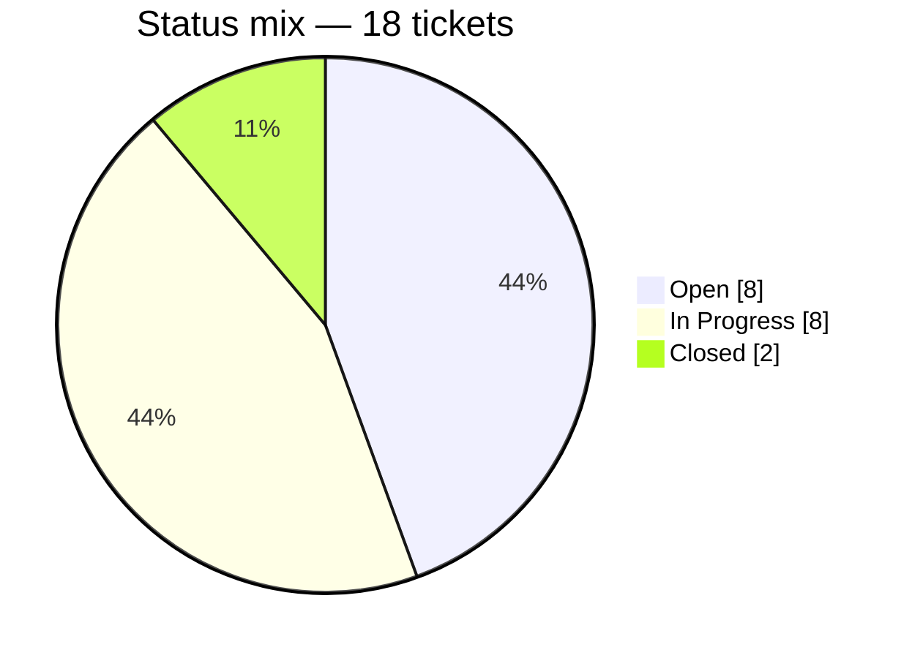
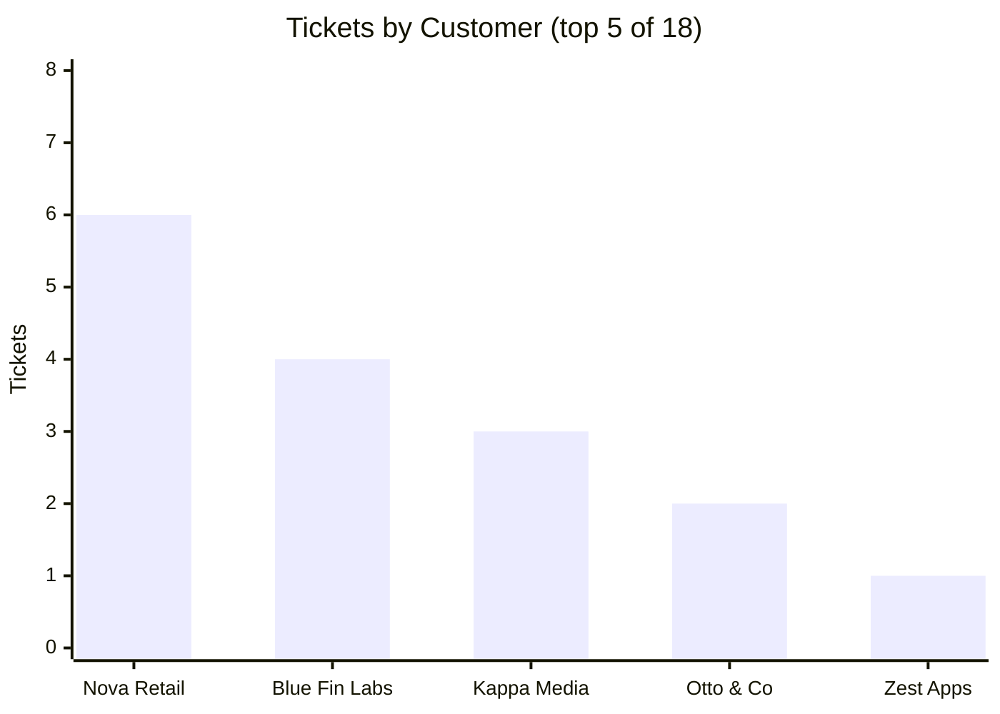
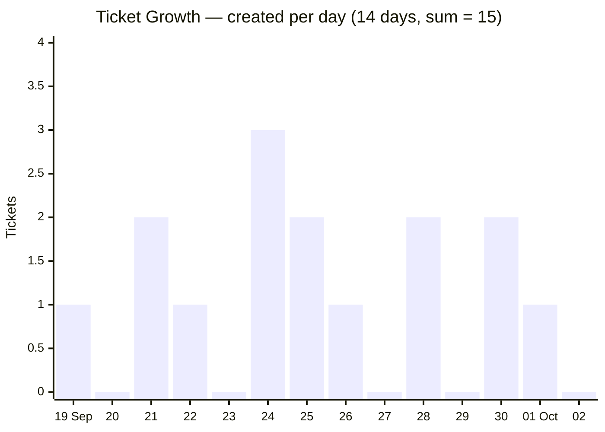
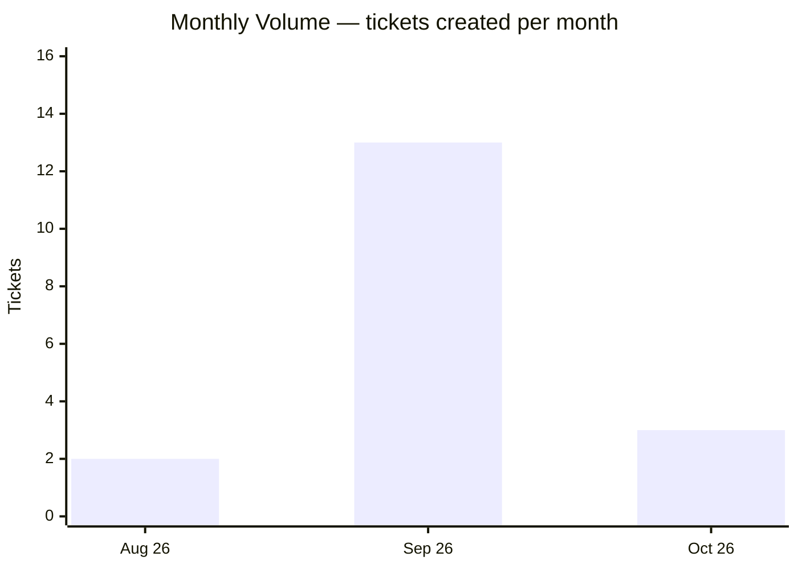
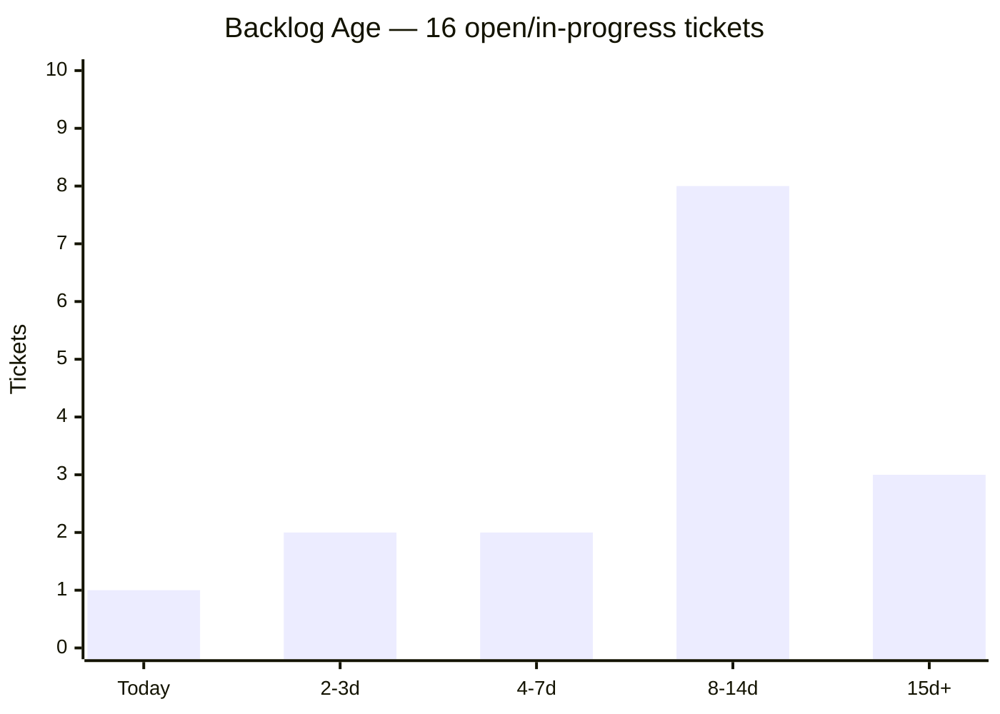
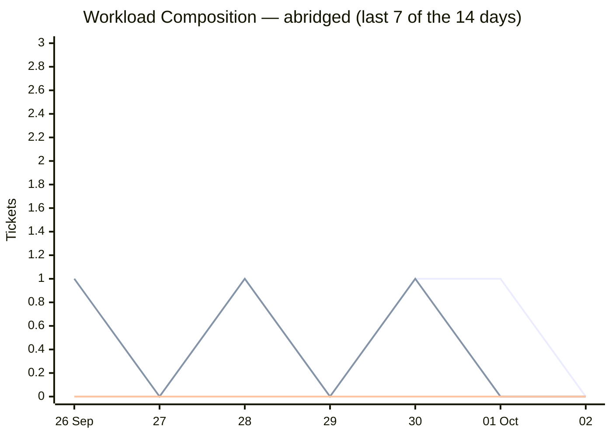
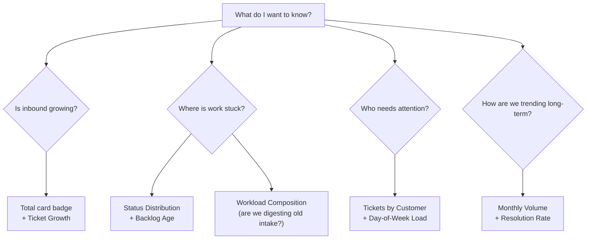

# 📊 The Getic Dashboard, Explained

> **What this doc is.** The dashboard shows four stat cards and eight charts, and every
> number on it comes from the same place — the ticket table in your room. This document
> explains, in plain English, what each card and chart **means**, **how it is computed**,
> and what a **real example** looks like. Diagrams are Mermaid — they render on GitHub.
>
> One rule to remember before anything else:
>
> **The dashboard measures the tickets in YOUR room. Nothing else.** No page-view
> analytics, no visitor tracking, no external data. If it happened outside the ticket
> table, it is not on this page.

---

## 1. Where the numbers come from

There is no separate analytics API. The page reads the **whole ticket list once** (the
same zustand store the Tickets page uses), and every card/chart is derived from that
array in a single pass, client-side:

```mermaid
flowchart LR
    DB[("Neon Postgres<br>(your room only)")]

    subgraph SERVER ["GET /api/tickets"]
        G["org-scoped query:<br>every ticket + its notes + assignee"]
    end

    STORE["zustand store<br>tickets &#91;&#93; (raw ISO dates)"]

    CALC["ONE useMemo:<br>count → group → bucket → window"]

    CARDS["4 stat cards"]
    CH1["1 · Status Distribution"]
    CH2["2 · Tickets by Customer"]
    CH3["3 · Resolution Rate"]
    CH4["4 · Ticket Growth"]
    CH5["5 · Day-of-Week Load"]
    CH6["6 · Monthly Volume"]
    CH7["7 · Backlog Age"]
    CH8["8 · Workload Composition"]

    DB --> G --> STORE --> CALC
    CALC --> CARDS & CH1 & CH2 & CH3 & CH4 & CH5 & CH6 & CH7 & CH8
```



Why this matters to how you *read* the page:

- **Everything is consistent.** The donut, the cards and the charts can never disagree —
  they are different views of the same 18 (or 180) rows, computed in the same instant.
- **It is instant.** Filters/paging happen in the browser (see PAGINATION.md), so the
  dashboard re-derives in memory whenever a ticket changes — no loading spinner.
- **It is tenant-walled.** The query filters by your active organization server-side;
  the numbers can only ever be your room's.

---

## 2. The worked example — "Sara's support desk"

To make every chart concrete, we'll follow one fictional room through the whole page.
Sara runs support for a small SaaS. At 10:00 on **Fri 2 Oct** she opens the dashboard
and sees:

| Metric | Value |
| --- | --- |
| Total Tickets | **18** |
| Open | **8** (44% of all) |
| In Progress | **8** (44% of all) |
| Closed | **2** (11% resolved) |
| Trend badge on Total | **−33% this week** |
| Backlog age buckets | **1 / 2 / 2 / 8 / 3** |

These numbers are internally consistent (as the real page's would be): the donut's
8 + 8 + 2 = 18, the backlog buckets 1+2+2+8+3 = 16 = every Open + In Progress ticket,
and the two closed tickets are the only ones not in the backlog. Keep this table open
in your head — every diagram below uses these exact numbers.

> A note on the trend: **−33% does not mean Sara is doing a bad job.** It counts
> *tickets created*, not work done. Last week 9 tickets arrived; this week only 6.
> Fewer fires started — that's usually good news.

---

## 3. The four stat cards

| Card | Big number | Badge | The question it answers |
| --- | --- | --- | --- |
| **Total Tickets** | every ticket ever created in the room | **−33% this week** — tickets created in the *last 7 days* vs the *7 days before* | "How big is this desk, and is inbound growing?" |
| **Open** | `status = OPEN` | share of all tickets | "How much is untouched?" |
| **In Progress** | `status = IN_PROGRESS` | share of all tickets | "How much is actively being worked?" |
| **Closed** | `status = CLOSED` | **% resolved** = closed ÷ total (lifetime) | "How much has been finished, ever?" |

The trend badge is a **creation-rate comparison**, not a workload comparison:

```
last7 = tickets created in days 0–6 ago        (Sat 26 Sep … Fri 2 Oct)  = 6
prev7 = tickets created in days 7–13 ago       (Sat 19 Sep … Fri 25 Sep) = 9
trend = round((6 − 9) / 9 × 100) = −33%
```

Edge cases handled honestly: if the previous week had **zero** tickets the badge shows
"no prior data" instead of a fake `+∞%`; `0` tickets this week is still a real `−100%`.

**Reading Sara's cards:** 18 tickets total, but 16 of them (89%) are still live — this
is a **young desk**, so the 11% lifetime resolution rate is not alarming by itself.
The badge says inbound is *cooling* (−33%), while the backlog chart (§4.7) will show
where the actual problem is.

---

## 4. The eight charts

Each chart below answers one question a support lead actually asks.

### 4.1 Status Distribution — "What does our work look like right now?"

A donut of **current status across all tickets** (statuses with 0 tickets are dropped
from the pie; the cards still show the 0). Sara's room:



**Read it as:** 44% of everything is untouched and 44% is mid-flight. Only 11% is done.
A healthy desk usually wants the Open slice shrinking and Closed growing over time.

### 4.2 Tickets by Customer — "Who keeps writing to us?"

Top 5 customers by ticket count, all-time. Sara's:



**Read it as:** Nova Retail alone produced a third of the desk's volume — worth a
proactive call before ticket #7 arrives. (The other 2 tickets came from two one-off
customers the top-5 cut-off doesn't show.)

### 4.3 Resolution Rate — "How much have we ever finished?"

A half-dial gauge showing **closed ÷ total, lifetime**:

```
resolution = round(2 / 18 × 100) = 11%
```

**Read it as:** a *cumulative* score, not this week's performance. For a desk that's
three weeks old (like Sara's) it lags reality — the two closed tickets can't outvote
sixteen live ones yet. Watch its *slope* over weeks, not its absolute value.

### 4.4 Ticket Growth — "Is inbound accelerating?"

Tickets **created per calendar day**, for the selected range (**7 / 14 / 30 days** —
the selector in the card's header). Sara's 14 days:



Details that are easy to misread:

- **Empty days show as 0 on purpose.** The window is a contiguous calendar range with
  every counter zero-filled first, then tickets folded in — a quiet Tuesday reads as
  zero, never as a gap in the line.
- **Day boundaries are YOUR local midnights.** The browser buckets by its own timezone;
  a ticket created 23:30 UTC lands on "yesterday" for a UTC+5:30 viewer. Two admins in
  different timezones can legitimately see slightly different daily bars.
- **The first / last 7 days of this chart are exactly the trend badge's inputs:**
  9 vs 6 → −33%.

The selector is **persisted** (`localStorage`, key `getic-dashboard-range`): pick
"Last 30 days", navigate away, come back tomorrow — it's still 30. Switching ranges
animates the morph between the two shapes.

### 4.5 Day-of-Week Load — "Which days hurt?"

A radar over **which weekday tickets were created** (all-time). Mermaid has no radar
chart, so here's Sara's week as the table the radar plots:

| Sun | Mon | Tue | Wed | Thu | Fri | Sat |
| --: | --: | --: | --: | --: | --: | --: |
| 1 | **5** | 4 | 3 | 2 | 2 | 1 |

**Read it as:** Monday is the spike (weekend mail dumps on Monday morning) and the week
decays toward Saturday. Practical use: staff Monday like it's two days, and schedule
maintenance *not* on Monday.

### 4.6 Monthly Volume — "What does the long arc look like?"

Tickets per **calendar month**, last 6 months with data (grows one bar per month
automatically). Sara's room opened in August:



**Read it as:** the long-range context the 14-day growth chart can't show. September
was the onboarding wave (13 tickets); October is still young (3 in two days).

### 4.7 Backlog Age — "How stale is the open work?" ⚠️ the important one

Every **Open + In Progress** ticket is aged by *days since created* and dropped into a
bucket: `Today · 2-3d · 4-7d · 8-14d · 15d+`. Closed tickets don't count — they're done.



**Read it as:** a histogram whose *shape* is the message.

- **Left-leaning** (tall on the left, tapering right) = fresh queue, work flows through.
- **Right-leaning / hump in the middle** = tickets are *aging* — work is queuing up
  faster than it's being finished.

Sara's has a hump: **8 tickets have sat for 8–14 days**, and 3 are past two weeks.
That — not the −33% inbound trend — is her real fire. The dashboard's single most
actionable chart.

### 4.8 Workload Composition — "What is each day's intake made of?"

The same daily window as Ticket Growth, but each day is **split by the current status
of the tickets created that day** (stacked area; Open + In Progress + Closed):



(top line = Open, middle = In Progress, bottom = Closed — the real chart stacks them)

**One subtlety worth knowing:** a ticket is colored by its **current** status, plotted
on its **creation** day. Sara's ticket from 19 Sep that was closed yesterday still sits
on 19 Sep — but now colored Closed. So the shape of "old" days *changes as you work*:
closing old tickets literally repaints history in green. That's a feature — it shows
which vintage of intake you've actually digested — but it means the chart is "current
status by birthday", not "what happened that day".

**Read it as:** are we *finishing* old intake, or only firefighting today's? Sara's
15d+ backlog (§4.7) says her early-September days are still mostly blue/amber.

---

## 5. Choosing the right chart



Cheat sheet:

| Card / chart | Question | Formula (all over your room's tickets) |
| --- | --- | --- |
| Total + badge | Is inbound growing? | count(all); trend = (last7 − prev7) / prev7 |
| Open | Untouched work | count(status = OPEN) |
| In Progress | Active work | count(status = IN_PROGRESS) |
| Closed + badge | Finished work | count(status = CLOSED); % = closed / total |
| Status Distribution | Shape of the work | group by status |
| Tickets by Customer | Loudest customers | group by customerName, top 5 |
| Resolution Rate | Lifetime finish share | closed / total |
| Ticket Growth | Created per day | count per local calendar day, zero-filled, 7/14/30-day window |
| Day-of-Week Load | Which weekday spikes | group by weekday of createdAt |
| Monthly Volume | Long arc | group by calendar month (last 6) |
| Backlog Age | Stale work | bucket (now − createdAt) of OPEN + IN_PROGRESS |
| Workload Composition | Intake mix per day | per day: split that day's tickets by *current* status |

---

## 6. Gotchas & honest limitations

- **It's a snapshot of the room, not a time machine.** Statuses are "as of now";
  historical status transitions aren't stored, so "how long did tickets *use* to take?"
  isn't derivable yet (that would need a status-history table).
- **Timezone sensitivity.** Daily charts bucket by the *viewer's* local midnight.
- **Resolution Rate is lifetime.** A busy desk with a long history moves this number
  slowly; don't read it as "this week's performance".
- **Composition repaints.** See §4.8 — old days are re-colored as old tickets close.
- **Zero-filled by design.** A flat 0 in Ticket Growth means "no tickets that day",
  not "no data".
- **Range selection persists** in your browser only (`getic-dashboard-range` in
  localStorage) — it's per-device, not synced to your account.

---

*Implementation: everything above is derived in
[app/dashboard/page.tsx](app/dashboard/page.tsx) (`useMemo` block, one pass over the
store's `tickets` array) on top of the full-array fetch described in
[PAGINATION.md](PAGINATION.md). Chart primitives: shadcn `<ChartContainer>` wrapping
Recharts; theming via `--chart-*` / `--color-*` CSS variables (auto light/dark).*
