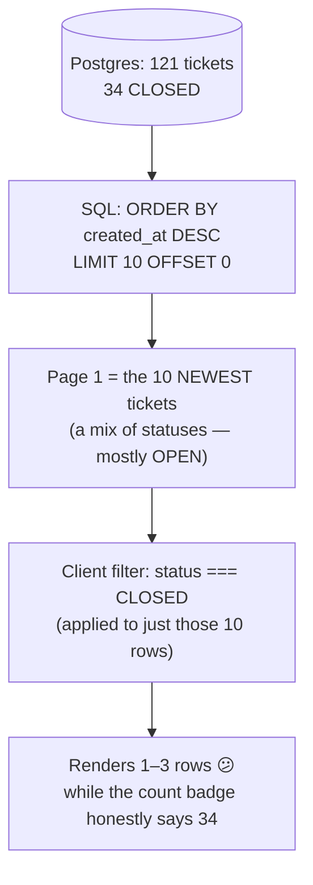
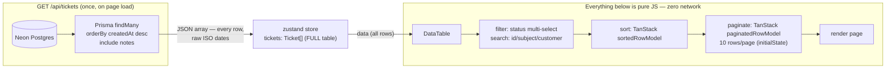

# Filtering & Pagination — Design Decision

> **TL;DR:** this app fetches **all tickets once** (`GET /api/tickets` → zustand
> store) and does filtering, searching, sorting and pagination **in the
> browser**. An earlier server-paginated implementation (`?page=&pageSize=`,
> SQL `LIMIT/OFFSET`) was **deliberately reverted** — at this app's scale it
> made the UI slower *and* made filters lie. This doc records both designs so
> the choice is defensible, not accidental.

---

## 1. The bug report that triggered the revert

> *"When I filter to see Closed tickets, the footer says 34 exist but only 1–3
> rows show. Rows per page is 10 — why only 3?"*

That report was **correct**, and it is the classic failure mode of mixing
server-side pagination with client-side filtering:



The server hands back a **status-mixed slice**; the filter can only operate on
what it received. The only fixes are:

1. **Filter in SQL too** — `WHERE status IN (...)` + `LIMIT/OFFSET`, counts via
   `GROUP BY`. Correct, but now *every* filter click is a network round-trip.
2. **Skip server paging entirely** — fetch everything once, filter/paginate in
   memory. Every interaction is instant and always truthful.

At 121 tickets (and realistically anything under a few thousand), option 2 is
strictly better UX with no measurable cost — a JSON array of 121 small rows
is a few KB and parses in milliseconds. **This app chose option 2.**

---

## 2. The current architecture (client-side everything)



**One network read in the entire page.** Everything after mount is local state:

| Operation | Where | Latency |
|---|---|---|
| Load page | network (once) | one round-trip |
| Filter by status | `Array.filter` | ~0ms |
| Search | `Array.includes` | ~0ms |
| Sort | TanStack row model | ~0ms |
| Change page / page size | TanStack row model | ~0ms |
| Create / edit / delete / note | optimistic store update | instant UI, one background call |

And because the full dataset is in memory, **every count is truthful by
construction**: the faceted Status filter's badges are `Array.filter(...).length`
over the same array the table filters — a badge says 34, the filter shows 34.

### Mutation behaviour (unchanged by the revert)

All mutations stay optimistic — the original zustand pattern:

- **Create** → `POST`, prepend the returned row (newest-first order).
- **Status / edit** → update the row locally, `PATCH` in the background, sync
  `updatedAt` from the response.
- **Delete (single/bulk)** → remove locally, `DELETE` in the background.
- **Add note** → `POST` (with fallback route), splice into the ticket's notes.

No refetch heuristics needed: the local array *is* the whole table, so a local
edit is always complete and consistent.

---

## 3. The server-paginated design (what was reverted, and what it's for)

For the record — the reverted design was textbook-correct, just aimed at the
wrong scale:

| Piece | Implementation |
|---|---|
| Params | `?page=2&pageSize=10`, parsed + clamped (`1 ≤ pageSize ≤ 100`) |
| Math | `skip = (page − 1) × pageSize` → SQL `LIMIT 10 OFFSET 10` (rows 11–20) |
| Correctness | Stable `ORDER BY created_at DESC` (without it, OFFSET paging can duplicate/skip rows across pages) |
| Metadata | Parallel `Promise.all`: `count()` → "Page 2 of 13", `groupBy({ by: ['status'] })` → whole-DB tab counts |
| Envelope | `{ data, total, page, pageSize, totalPages, statusCounts }` |
| Client | TanStack `manualPagination: true` + controlled `state.pagination` + `rowCount`; a **race guard** (module-level sequence number) discarded stale responses on fast clicks |

What it buys you, and when you'd re-introduce it:

- **Payload bounded** — matters when the table has tens of thousands of rows,
  or rows carry heavy payloads (this one's rows are tiny; notes are the bulk).
- **DB does the filtering** — with paging *plus* `?status=&search=` params,
  every interaction stays correct at any scale.
- **Multi-user freshness** — pages always reflect the DB as of *now*; a
  long-lived client-side array can go stale if others mutate data (irrelevant
  for a single-user demo; real for a team tool without websockets).

### If this app grows up: the migration path

The honest answer to "what happens at 50,000 tickets?" is a **hybrid**:

```sql
-- filter in SQL, page in SQL, count once
SELECT * FROM "Ticket"
WHERE status IN (...) AND (subject ILIKE '%q%' OR ...)
ORDER BY created_at DESC
LIMIT 10 OFFSET 10;
SELECT status, COUNT(*) FROM "Ticket" GROUP BY status;
```

…served as the same envelope, consumed by re-introducing
`manualPagination`/`rowCount` and passing filter values into the store actions.
The UI components wouldn't change shape — only the store's fetch URL and the
table's pagination mode. Two real knobs, already designed for once.

### OFFSET vs cursor paging (interview follow-up)

`OFFSET` walks past the rows it discards, so deep pages get slower (page 5,000
reads 50,000 rows). **Cursor/keyset paging** (`WHERE created_at < $last_seen
ORDER BY created_at DESC LIMIT 10`) is O(1) per page but can't support
"jump to last page" buttons. OFFSET fits this app's first/last/next/prev
footer; infinite-scroll UIs should use cursors.

---

## 4. The dashboard note

The analytics charts aggregate the **whole** table, which is exactly what the
full-array fetch provides for free — no `?all=1` split needed anymore. (When
server paging existed, the dashboard needed a separate full fetch to avoid
charting just one page — a good illustration of how paging leaks complexity
into every consumer.)
